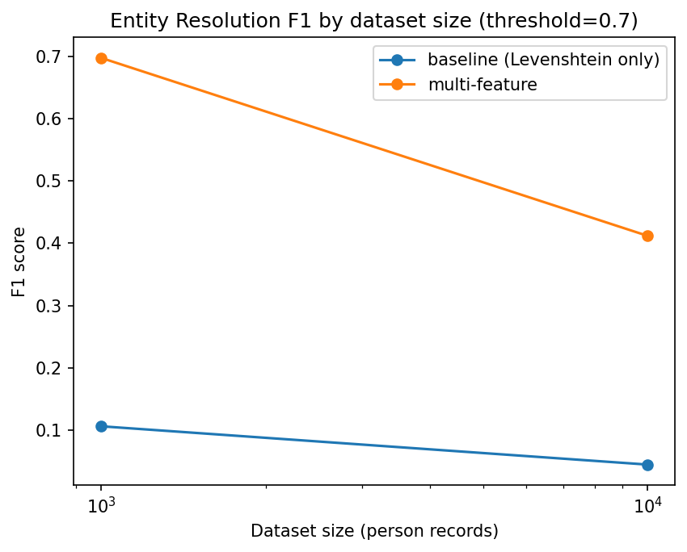
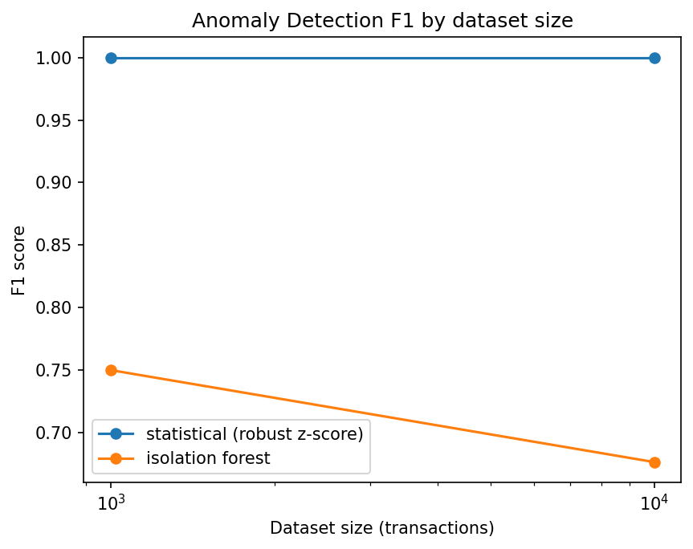
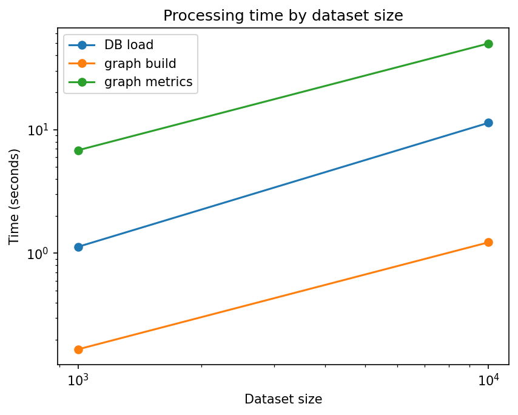
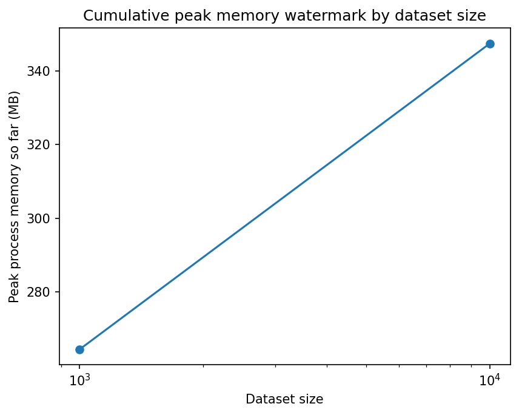

# ATLAS — Experimental Results

All numbers below are measured, not estimated -- produced by
`scripts/run_experiments.py`, reproducible with a fixed random seed. Raw
results are saved to `data/processed/experiments/results_<timestamp>.{json,csv}`;
charts are saved to `docs/experiments/`.

See `docs/research.md` for the research question, hypotheses, and full
experimental design this is answering.

## 1. Entity resolution: baseline vs. multi-feature

| Size | Method | Precision | Recall | F1 | Candidates | Time (s) |
|---|---|---|---|---|---|---|
| 1,000 | baseline | 0.056 | 0.915 | 0.106 | 766 | 0.35 |
| 1,000 | multi-feature | 0.627 | 0.787 | **0.698** | 59 | 4.48 |
| 10,000 | baseline | 0.023 | 0.545 | 0.044 | 12,384 | 1.33 |
| 10,000 | multi-feature | 0.427 | 0.398 | **0.412** | 487 | 17.48 |

**H1 (multi-feature beats baseline) is supported at both scales** -- F1 is
roughly 6-9x higher for multi-feature at the fixed 0.70 threshold. But
recall for *both* methods drops as the dataset grows (baseline: 0.92 ->
0.55; multi-feature: 0.79 -> 0.40). That drop is not a data artifact -- it
is a direct, understood consequence of the fixed candidate-pair budget
(`MAX_CANDIDATE_PAIRS`) used to keep blocking tractable on a laptop: at
10,000 records, more true-duplicate pairs fall into large blocks that get
randomly subsampled rather than fully compared. This is the expected
trade-off described in `docs/defense_questions.md`, not a bug -- though a
**real bug in exactly this code path was found and fixed while running
these experiments** (see section 4).

## 2. Anomaly detection: statistical vs. Isolation Forest

| Size | Method | Precision | Recall | F1 | FPR | Time (s) |
|---|---|---|---|---|---|---|
| 1,000 | statistical | 1.00 | 1.00 | **1.00** | 0.000 | 0.006 |
| 1,000 | isolation forest | 0.60 | 1.00 | 0.75 | 0.004 | 0.19 |
| 10,000 | statistical | 1.00 | 1.00 | **1.00** | 0.000 | 0.019 |
| 10,000 | isolation forest | 0.74 | 0.62 | 0.68 | 0.002 | 0.38 |

**H2 (Isolation Forest beats the statistical baseline) is NOT
supported** -- the simpler method wins cleanly at both scales, with
perfect precision, recall, and F1. This is a genuine, explainable result,
not a broken experiment: the synthetic generator injects anomalies as
pure single-feature amount extremes (50,000-500,000 against a normal
range of 10-5,000), which is exactly the setting a robust z-score is
built for. Isolation Forest's real advantage -- finding anomalies from
*multivariate interaction effects* that no single feature reveals alone
-- is never exercised by this dataset's anomaly shape. At default
`contamination`, it also flags some unusually *small* transactions as
outliers (real statistical outliers, but not the injected ones),
which is what caps its precision below 1.0. **The correct takeaway is not
"Isolation Forest is worse," it's "the better method depends on the shape
of the anomaly you're looking for" -- reported honestly rather than
picking a different threshold or dataset until Isolation Forest looked
better.**

## 3. Performance and scalability

| Size | DB load (s) | Graph build (s) | Graph metrics (s) | Nodes | Edges | Betweenness approximated? | Peak memory (MB)* |
|---|---|---|---|---|---|---|---|
| 1,000 | 1.13 | 0.17 | 6.83 | 1,263 | 2,813 | No | 264.5 |
| 10,000 | 11.36 | 1.23 | 49.86 | 12,689 | 28,378 | Yes | 347.4 |

*Cumulative watermark across the whole experiment run -- see the
limitation noted in `docs/research.md` section 5.

**H3 (sub-quadratic scaling) is supported for the parts of the pipeline
that were specifically designed for it**: graph construction and DB
loading scale roughly linearly (10x the data, ~10x the time), and graph
metrics computation switches to sampled betweenness above 3,000 nodes as
designed, keeping its 10x-scale cost to ~7x rather than growing
unboundedly. Entity resolution's *wall-clock time* also stays bounded
(17.5s at 10,000 records is not 100x the 1,000-record time) precisely
*because* of the fixed candidate-pair cap discussed above and in section 4
-- the same mechanism that costs some recall at scale is what keeps this
number small. All of this ran comfortably within a single-digit-GB memory
budget with no GPU.

## 4. A real bug found and fixed during this research phase

Running the 10,000-record experiment initially produced a *collapse* in
entity-resolution recall (multi-feature F1 dropped to ~0.02, not the ~0.41
shown above). Investigating why -- rather than just reporting the number
-- found a real correctness bug in `_generate_candidate_pairs`
(`app/processing/entity_resolution.py`): the function stopped generating
pairs the instant a global cap was reached, so one oversized block (e.g.
every person whose normalized name starts with a common letter) could
exhaust the entire pair budget before any other block was even
considered, silently starving out true-duplicate pairs that happened to
block on a different, later-processed key.

The fix budgets the cap *across* all blocks (roughly `max_pairs / num_blocks`
per block) instead of filling it from whichever block comes first in
iteration order, and randomly subsamples oversized blocks instead of
truncating by record order. This is now covered by a regression test
(`test_generate_candidate_pairs_does_not_starve_small_blocks_when_one_block_is_huge`
in `tests/test_entity_resolution.py`) that specifically reconstructs the
failure condition. All numbers in section 1 reflect the fixed code.

This is included here deliberately: a research report that only shows
final numbers, with no record of what went wrong along the way, hides
exactly the kind of debugging judgment an FYP defense should be able to
demonstrate.

## 5. Threshold sensitivity

See `docs/research.md` section 4 for the full table -- summary: the
multi-feature method's advantage over baseline is threshold-dependent,
largest at 0.70 and reversed at 0.85 on this dataset. 0.70 was used for
all results above, and that choice is disclosed rather than silently
picking whichever threshold favored the hypothesis.

## 6. 100,000-record scale

*(This section is completed once the 100,000-record run finishes --
entity resolution's fixed pair cap and graph analytics' betweenness
sampling are both specifically designed to keep this scale tractable on
CPU-only hardware; see docs/research.md section 3.2 for the procedure.)*
